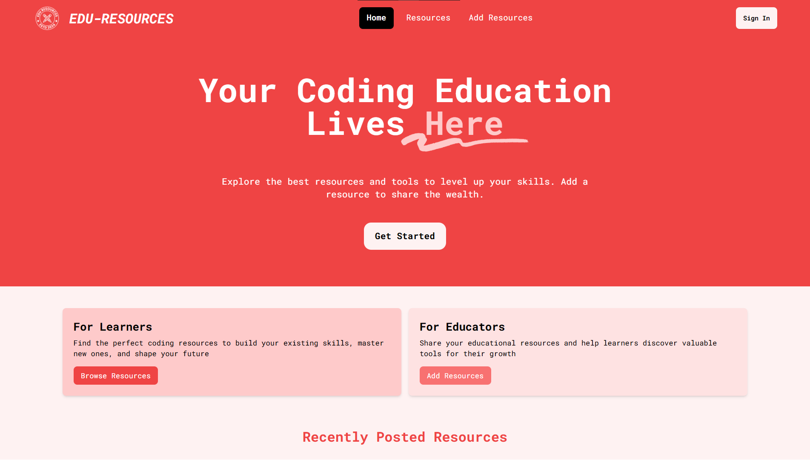

# **Edu Resources**

A platform for educators to share valuable coding tools, guides, and materials, and for learners to browse and discover the best resources to enhance their coding skills.



### *Edu Resources is now live [here](https://eduresources.site/)!*

## **Features**

* **For Educators:** Share your educational tools, courses, tutorials, and materials with the learning community.
* **For Learners:** Browse curated coding resources, including courses, guides, tutorials, and more to start or advance your coding journey.
* **CRUD Functionality:** Add, edit, and remove resources to keep the library up to date.
* **Filter:** Easily search for resources based on type, skill level, and category.
* **Authentication:** Google Strategy
* **Users:** A profile with the ability to browse all of your own resources.

## **Tech Stack**

* **Frontend:** React.js
* **Backend:** **(New)** Node.js, Express, Mongoose, MongoDB **(Old)** JSON Server API
* **Routing:** React Router DOM and Express Router
* **State Management:** React `useState`
* **Styling:** Tailwind CSS
* **Dev Tools:** Vite, ESLint, PostCSS


## **Getting Started**

### 1. Clone the repository

`git clone https://github.com/jolyssa/edu-resources.git`

### 2. Install dependencies

Navigate to the project directory and install the necessary dependencies:

```js
//Frontend
cd edu/
npm install

//Backend
cd backend/
npm install
```

### 3. Start the server

For development purposes, run the API with the following (make sure you're in backend/):

`node server.js --watch`

The API should now be available at `http://localhost:5000/api/resources`.

### 4. Run the application

In another terminal window, start the application locally (make sure you're in edu/):

`npm run dev`

The app should now be running at `http://localhost:4444`.

## **How It Works**

### **For Educators:**

Educators can add their educational materials, guides, and courses by clicking "Add Resources". Each resource can include details like title, description, type (course, tutorial, etc.), and more.

### **For Learners:**

Learners can browse through a list of curated resources to find the perfect content based on their skill level and interests.

### **CRUD Operations:**

* **Add a Resource:** Create new educational tools or content for others to access.
* **Edit a Resource:** Modify existing resources to ensure they are up-to-date.
* **Delete a Resource:** Remove outdated or irrelevant resources.

### **Routing with React Router:**

This app uses **React Router** to handle navigation between different pages, such as the home page, the "Add Resource" page, and individual resource detail pages.

### **State Management with React `useState`:**

State is managed using React's `useState` hook to dynamically render data (e.g., resources) and handle updates across the app.

### **Styling with Tailwind CSS:**

* [ ] The app uses **Tailwind CSS** for styling, providing a fast and efficient way to design responsive, customisable user interfaces.

## **Contributing**

I welcome contributions to improve this platform! If you'd like to help, please follow these steps:

1. Fork the repository
2. Create a new branch (`git checkout -b feature/your-feature-name`)
3. Make your changes
4. Commit your changes (`git commit -m 'Add new feature'`)
5. Push to the branch (`git push origin feature/your-feature-name`)
6. Create a pull request
