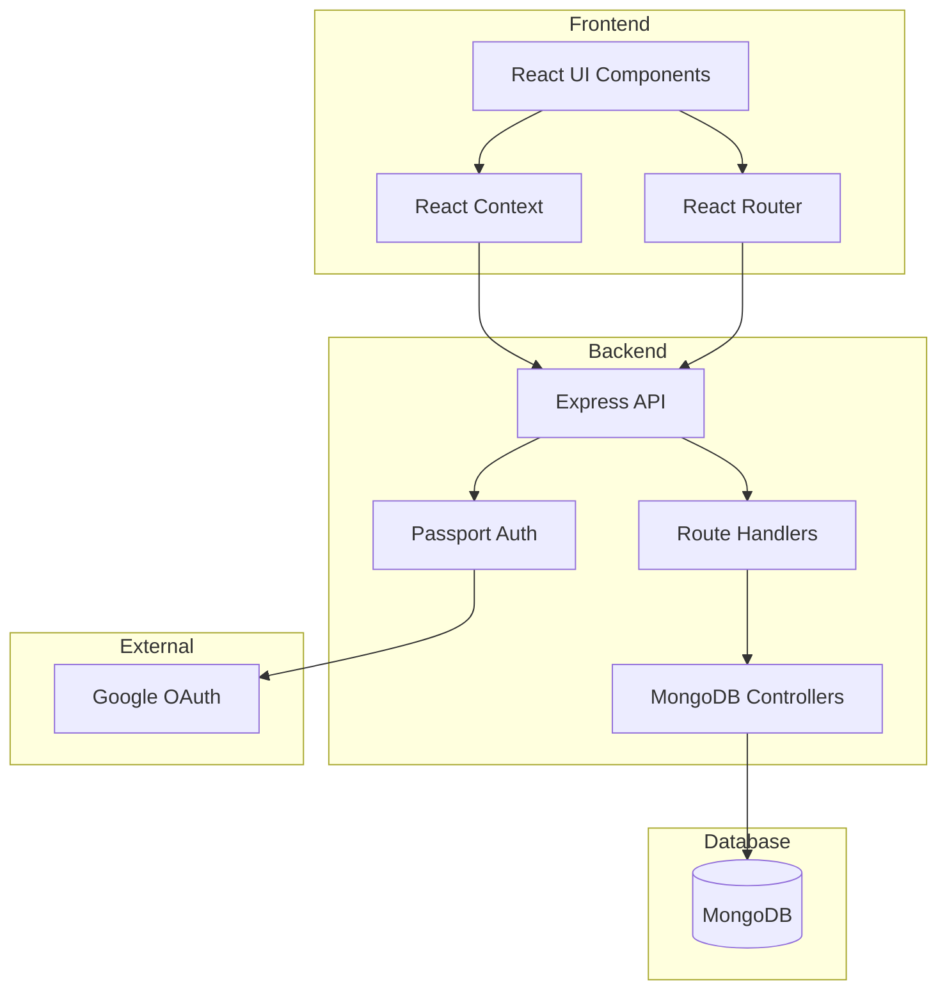

# Project Flow

```mermaid  
flowchart TD
    subgraph Frontend
        UI[React UI Components]
        RC[React Context]
        RR[React Router]
    end

    subgraph Backend
        API[Express API]
        Auth[Passport Auth]
        Routes[Route Handlers]
        MC[MongoDB Controllers]
    end

    subgraph Database
        MDB[(MongoDB)]
    end

    subgraph External
        Google[Google OAuth]
    end

    UI --> RC
    UI --> RR
    RC --> API
    RR --> API
    API --> Auth
    Auth --> Google
    API --> Routes
    Routes --> MC
    MC --> MDB
```